# 📚 Projet M2 ESI – Machine Learning & Deep Learning

Ce projet est divisé en **3 parties**, chacune explorant une facette du Machine Learning ou du Deep Learning à travers un cas concret :

1. **Reconnaissance d’images avec CNN (TensorFlow + Keras)**
2. **Détection de fraude avec données tabulaires (Scikit-learn)**
3. **Analyse de texte (NLP) avec LSTM (TensorFlow)**

---

## Partie 1 : Reconnaissance d’Images avec les CNN

### 🔍 Objectif
Construire un modèle CNN pour classifier les images du dataset CIFAR-10.

### 📸 Captures d'écran

1. **Affichage d’images du dataset**  
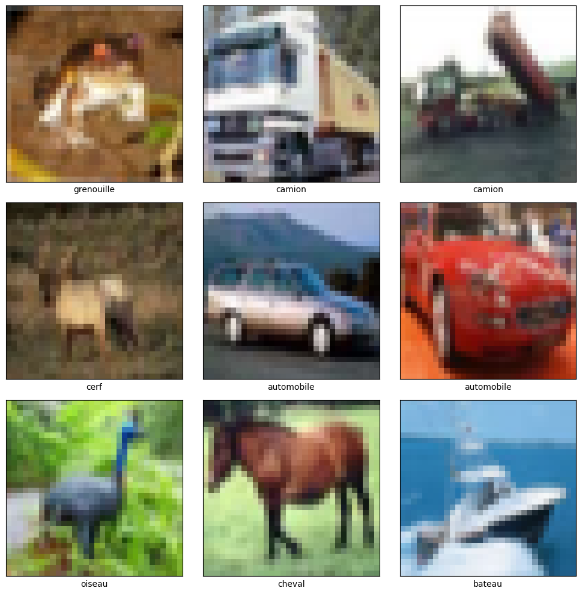

2. **Console d'entraînement du modèle**  
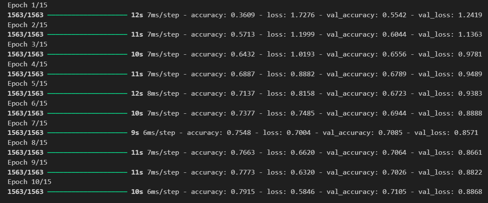

3. **Courbes d’apprentissage (accuracy / loss)**  
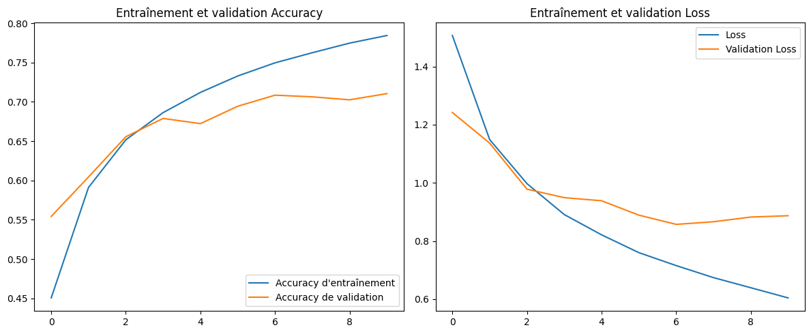

4. **Matrice de confusion**  
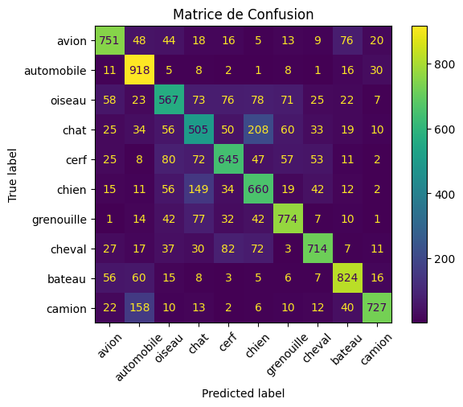

5. **TensorBoard** *(optionnel)*  
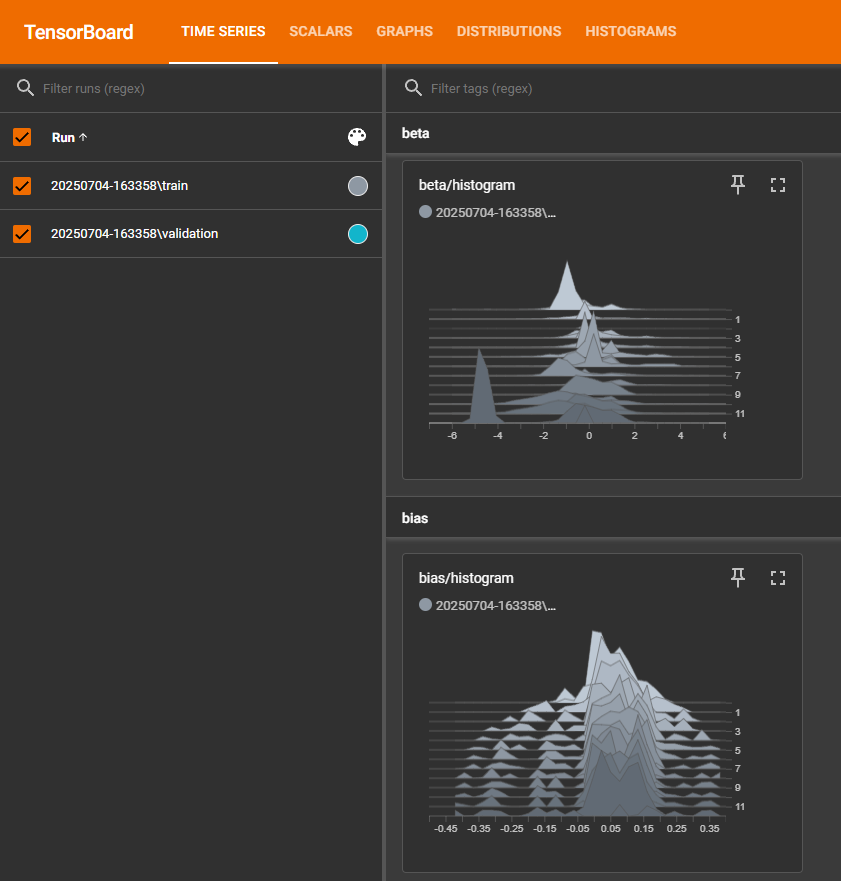

6. **Tableau de test d’hyperparamètres** *(si implémenté)*  


---

### ❓ Questions / Réponses Partie 1

#### 1. Quel a été le rôle des callbacks ModelCheckpoint et EarlyStopping ? Ont-ils été utiles pendant votre entraînement ?
> Un callback est une fonction qui va être appelé automatiquement à chaque époque sans qu’on est à intervenir manuellement.

> Le callback ModelCheckpoint sert à récupérer le meilleur modèle à chaque passage. L’EarlyStopping lui, arrête l’apprentissage du modèle si celui-ci arrête de s’améliorer pendant un nombre d’époque donnée.

> Oui les deux callbacks ont été utiles pendant l’entrainement de notre modèle, ModelCheckpoint a récupéré la meilleure version de notre modèle et EarlyStopping a stoppé l’apprentissage de notre modèle après 12 époques.


#### 2. Analysez les courbes d'apprentissage (perte et précision). Votre modèle présente-t-il des signes de sur-apprentissage ou de sous-apprentissage ? Comment la matrice de confusion vous aide-t-elle à comprendre les erreurs du modèle ?
> Oui on aperçoit des signes de sur-apprentissage, le modèle est très bon sur les données d’entraînement, la précision augmente au fil des époques. Cependant pour les données de validation, on voit qu’à partir de l’époque 3, notre modèle commence à stagner.

> Sur le graph de perte, on voit que le modèle réduit bien l’erreur des données d’entraînement mais il y a de plus en plus sur les données de validations.

> On comprend que le modèle apprend et mémorise très bien sur les données d’entrainement mais a du mal sur les données inconnues ce qui serait un signe de sur-apprentissage.

> La matrice de confusion va nous permettre de savoir où le modèle se trompe entre les prédictions correctes et les erreurs de classification. On peut voir que les bonnes prédictions de notre modèle sur la ligne en diagonale. 

> Le modèle a beaucoup confondu chien/chat, cheval/cerf, camion/voiture il a du mal à différencier les éléments qui se ressemble.


#### 3. Quels ont été les principaux défis rencontrés ? Comment pourriez-vous améliorer les performances de ce premier modèle ?
> La compréhension des paramètres lors de la création du modèle était le défi principal

> Pour améliorer notre modèle, on pourrait lui donner plus de données sur les classes mal reconnues et plus de variations sur ses images. Ajouter plus de couches de neurones et améliorer les hyperparamètres du modèle (nombre de filtre, learning_rate etc).


#### 4. Comparez les performances (précision, temps d'entraînement) du modèle simple et du modèle basé sur le transfert d'apprentissage. Pourquoi observe-t-on une telle différence ?
> Le modèle CNN a mis 1 minute et 49 secondes pour s’entraîner, tandis que le modèle basé sur le transfert d’apprentissage (MobileNetV2) a pris 6 minutes et 35 secondes

> Malgré un temps d’entraînement beaucoup plus long, le modèle par transfert a obtenu des performances inférieures au CNN sur ce jeu de données. Cela s’explique par le fait que seule la "tête" du modèle a été entraînée, et que la base MobileNetV2 est initialement conçue pour des images plus grandes que celles du dataset CIFAR-10.

> En revanche, même si le CNN est plus performant ici, il montre des signes de sur-apprentissage, alors que le modèle par transfert reste plus stable et généralise mieux.

---

## Partie 2 : Données Tabulaires – Détection de Fraude

### 📸 Captures d'écran

1. **Analyse exploratoire des données (EDA)**  
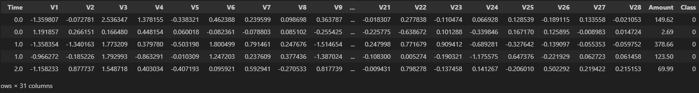

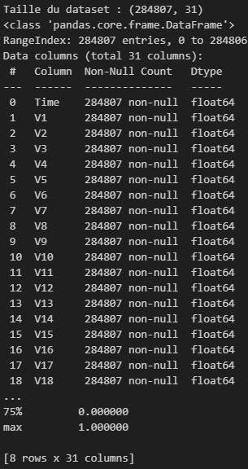

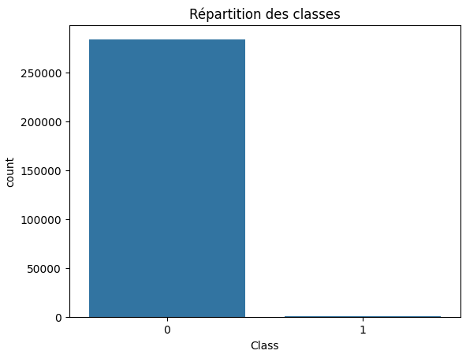

2. **Console d'entraînement du modèle RandomForest**  
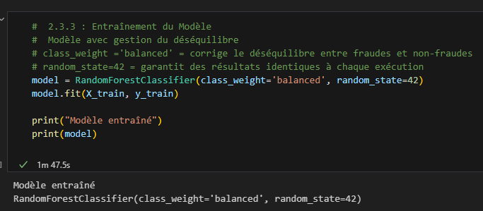

3. **Matrice de confusion + classification report**  
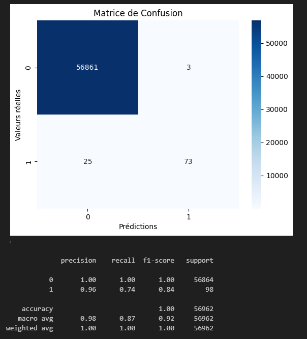

---

### ❓ Questions / Réponses Partie 2

#### 1. Expliquez le rôle du paramètre `class_weight='balanced'`. Quelles autres techniques auriez-vous pu utiliser pour gérer le déséquilibre des classes ?
> `class_weight='balanced'` sert a corriger le déséquilibre entre les classes fraude et non-fraude.

> On peut réduire le nombre d'exemples non frauduleux ou utliser d'autres algorithmes pour gérer le déséquilibre des classes comme XGBoost avec '`scale_pos_weight'`.

#### 2. Quel type d'apprentissage et quel type de problème est-ce ? Argumentez.
> Il s'agit d’un apprentissage supervisé : on donne au modèle des exemples avec leur résultat (fraude ou non).

> Le problème est une classification binaire : on a deux classes (fraude ou non).
> - 0 → transaction normale
> - 1 → transaction frauduleuse 
> Ducoup le modèle apprend à prédire une classe, et non une valeur numérique comme dans un problème de régression

#### 3. Donnez un exemple de régression lié à ce type de données, mettez un exemple via argumentation et image.

> Un exemple de régression serait de prédire le montant probable d’une prochaine transaction ou estimer le montant moyen attendu sur une période donnée, ou encore le nombre de transactions futures pour un client.

> Cela permettrait de repérer les montants anormalement élevés ou faibles par rapport au profil habituel, et donc de renforcer la détection de fraudes.

> Par exemple, si un utilisateur a généralement des transactions autour de 15€, mais que le modèle prédit 19€ et qu’il envoie une transaction de 3 000€, on peut détecter ce probleme et la mettre en alerte.

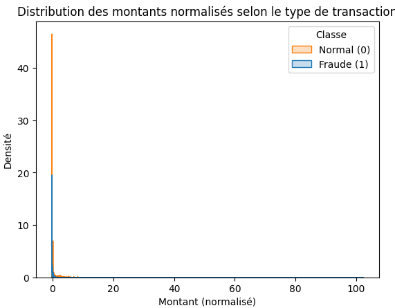
---

## 📁 Arborescence du dépôt

```
ML_DL/
├── images/
│   ├── cam.png
│   ├── capture1.png
│   ├── capture2.png
│   ├── capture3.png
│   ├── capture4.png
│   ├── capture5.png
│   ├── capture7.1.png
│   ├── capture7.2.png
│   ├── capture7.3.png
│   ├── capture8.png
│   ├── capture9.png
│   └── p2_argumentation.png
├── logs/
│   └── (fichiers générés par TensorBoard)
├── best_cnn_model.keras
├── best_transfer_model.keras
├── best_model_nlp.keras
├── temp_model.keras
├── creditcard.csv                         # Dataset pour la Partie 2
├── personal_expense_classification.csv    # Dataset pour la Partie 3
├── partie1_CNN.ipynb                      # Notebook Partie 1 (CIFAR-10)
├── partie2_Tabulaires_RF.ipynb            # Notebook Partie 2 (Fraude)
├── partie3_NLP_LSTM.ipynb                 # Notebook Partie 3 (NLP)
├── README.md
```

---

## ✉️ Auteurs
- Jayson, Sofiane, Hamidou, Antony et Ramdhan 
- Promo : Master 2 ESI
