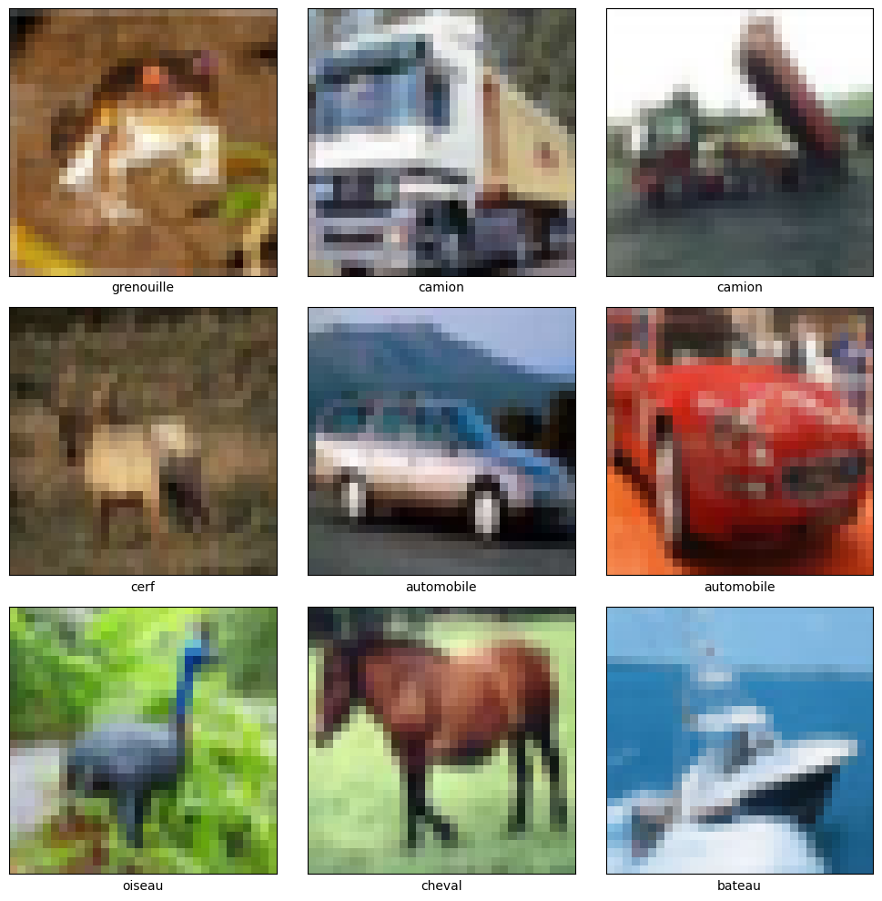
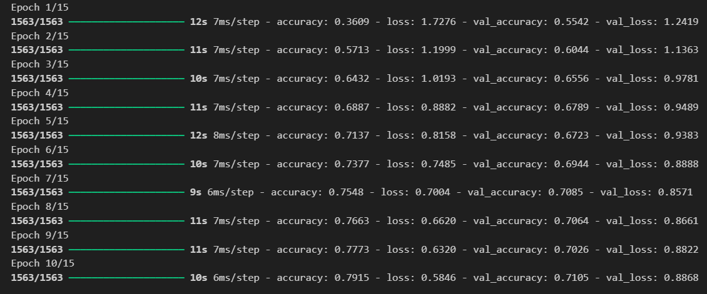
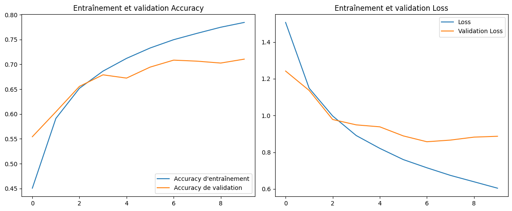
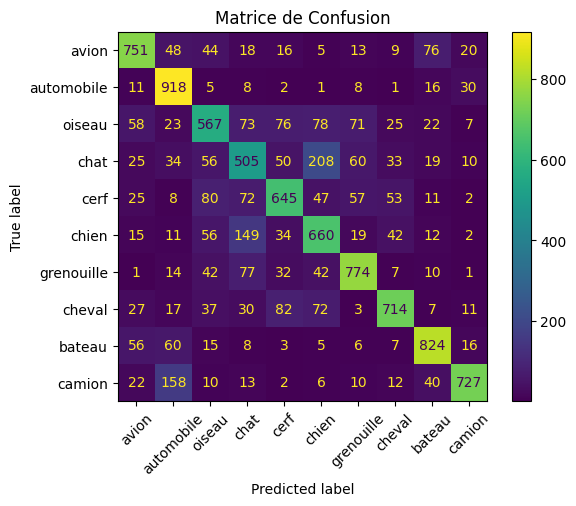
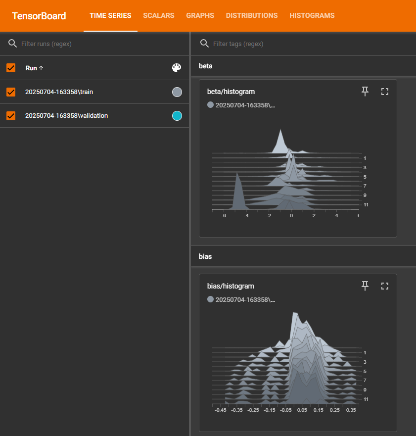
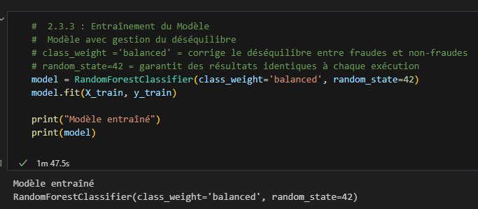
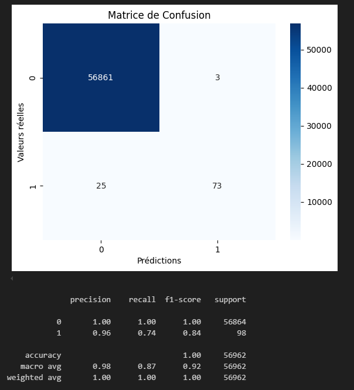

# 📚 Projet M2 ESI – Machine Learning & Deep Learning

Ce projet est divisé en **3 parties**, chacune explorant une facette du Machine Learning ou du Deep Learning à travers un cas concret :

1. **Reconnaissance d’images avec CNN (TensorFlow + Keras)**
2. **Détection de fraude avec données tabulaires (Scikit-learn)**
3. **Analyse de texte (NLP) avec LSTM (TensorFlow)**

---

## Partie 1 : Reconnaissance d’Images avec les CNN

### 🔍 Objectif
Construire un modèle CNN pour classifier les images du dataset CIFAR-10.

### 📸 Captures d'écran

1. **Affichage d’images du dataset**  


2. **Console d'entraînement du modèle**  


3. **Courbes d’apprentissage (accuracy / loss)**  


4. **Matrice de confusion**  


5. **TensorBoard** *(optionnel)*  


6. **Tableau de test d’hyperparamètres** *(si implémenté)*  


---

### ❓ Questions / Réponses Partie 1

#### 1. Quel a été le rôle des callbacks ModelCheckpoint et EarlyStopping ? Ont-ils été utiles pendant votre entraînement ?
> 

#### 2. Analysez les courbes d'apprentissage (perte et précision). Votre modèle présente-t-il des signes de sur-apprentissage ou de sous-apprentissage ? Comment la matrice de confusion vous aide-t-elle à comprendre les erreurs du modèle ?
> 

#### 3. Quels ont été les principaux défis rencontrés ? Comment pourriez-vous améliorer les performances de ce premier modèle ?
> 

#### 4. Comparez les performances (précision, temps d'entraînement) du modèle simple et du modèle basé sur le transfert d'apprentissage. Pourquoi observe-t-on une telle différence ?
> 

---

## Partie 2 : Données Tabulaires – Détection de Fraude

### 📸 Captures d'écran

1. **Analyse exploratoire des données (EDA)**  


2. **Console d'entraînement du modèle RandomForest**  


3. **Matrice de confusion + classification report**  


---

### ❓ Questions / Réponses Partie 2

#### 1. Expliquez le rôle du paramètre `class_weight='balanced'`. Quelles autres techniques auriez-vous pu utiliser pour gérer le déséquilibre des classes ?
> 

#### 2. Quel type d'apprentissage et quel type de problème est-ce ? Argumentez.
> 

#### 3. Donnez un exemple de régression lié à ce type de données.
> 

---

## Partie 3 : NLP – Catégorisation de Dépenses

### 📸 Captures d'écran

1. **Aperçu du dataset texte**  


2. **Architecture du modèle LSTM (summary)**  


3. **Courbes d’apprentissage NLP**  


---

### ❓ Questions / Réponses Partie 3

#### 1. Quel est l’intérêt de la couche `TextVectorization` ?
> 

#### 2. Pourquoi utilise-t-on une couche `Embedding` ?
> 

#### 3. Quelle est l'utilité de `Bidirectional(LSTM)` ?
> 

---

## 📁 Arborescence du dépôt

```
├── images/
│ ├── capture1.png
│ ├── capture2.png
│ └── ...
├── README.md
└── rapport.pdf
├── partie1_CNN.ipynb
├── partie2_Tabulaires_RF.ipynb
├── partie3_NLP_LSTM.ipynb
```

---

## ✉️ Auteurs
- Jayson, Sofiane, Hamidou, Antony et Ramdhan 
- Promo : Master 2 ESI